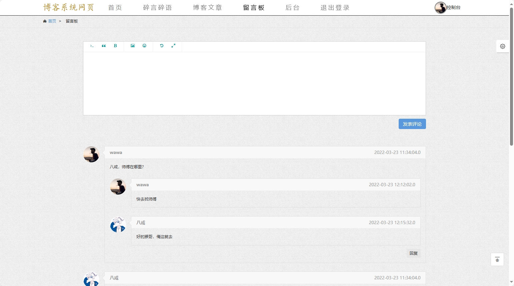

# 博客系统(文末获取方式☟)
> 
#### 介绍
博客系统
有BUG可留言加微

#### 软件架构
Java + SpringBoot + Mybatis + Mysql

#### 项目说明

> + 多用户登录
> + 注册
> + 个人中心
> + 个人发帖
> + 文字评论
> + 留言板和留言回复
> + 首页轮播图
> + 博客列表/详情
> + 碎片展示
> + 用户管理
> + 评论管理
> + 舆情预警等

### 部分功能演示

### 环境需求(可免费提供)
- idea/eclipse、jdk-1.8、maven-3.8.6、mysql、nodejs等

## 有项目修改、安装调试需求 请联系以下

## 获取资源扫☝☝☝
